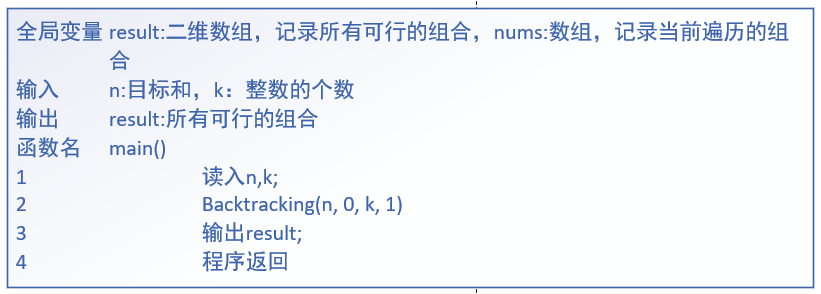
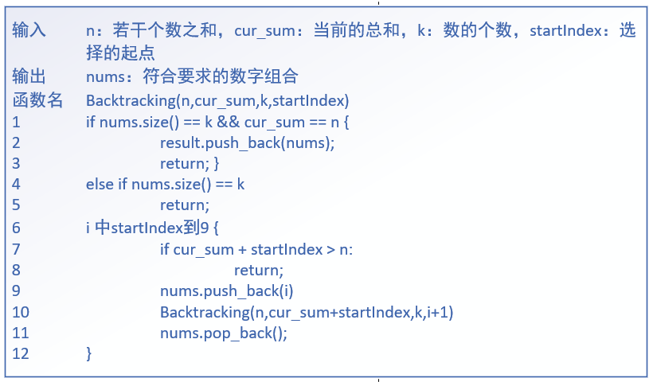
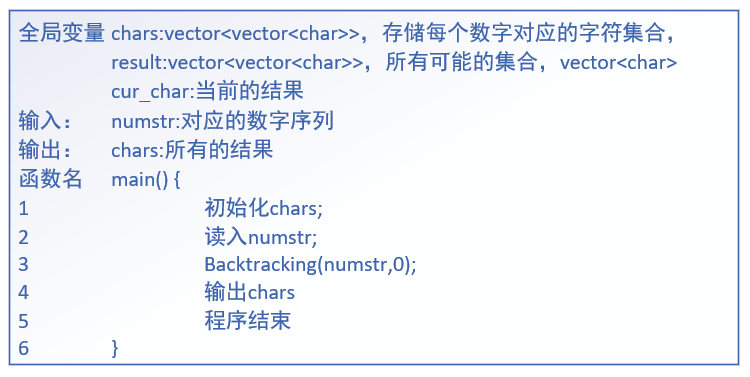
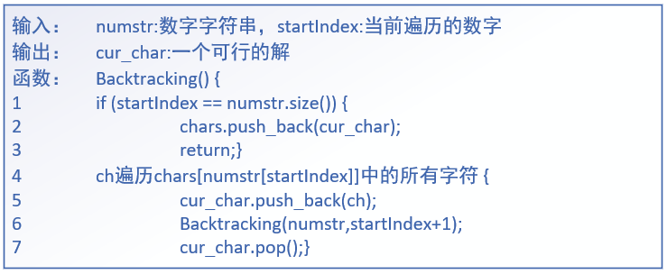
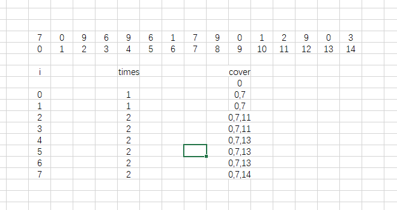
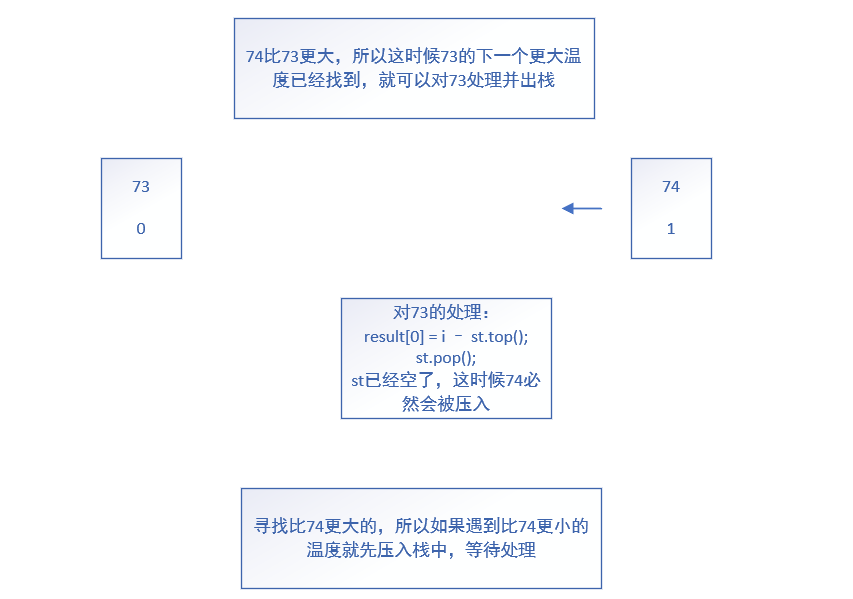

# 刷题日记

## 回溯算法

### 1.[组合](./problems/0077.组合.md)

次数：1

### 2.[组合总和III](./problems/0216.组合总和III.md)

次数：1

main()伪代码


Backtracking()伪代码


### 3.[电话号码的字母组合](./problems/0017.电话号码的字母组合.md)

[次数：1](https://leetcode.cn/problems/letter-combinations-of-a-phone-number/)

main()伪代码


Backtracking()伪代码


### 4.[N皇后](./problems/0051.N皇后.md)

[次数：1](https://leetcode.cn/problems/n-queens/)

## 贪心算法

### 1.[分发饼干](./problems/0455.分发饼干.md)

次数：1

### 2.[摆动序列](./problems/0376.摆动序列.md)

[贪心：1](https://leetcode.cn/problems/wiggle-subsequence/)

最摆烂的一集，我自己都没写，直接看的解析，不过还是有收获

动规：0

### 3.[最大子序和](./problems/0053.最大子序和.md)

> 感觉这道题的贪心和动规有点像啊  --24.5.21

贪心：1

动规：0

### 4.[买卖股票的最佳时机II](./problems/0122.买卖股票的最佳时机II.md)

> 用了一点差分的知识

贪心：1

### 5.[跳跃游戏](./problems/0055.跳跃游戏.md)

次数：1

### 6.[跳跃游戏II](./problems/0045.跳跃游戏II.md)

次数：1

这道题还真没有想象的那么简单，开始处理不好times什么时候该怎加



---

## 动态规划

### 背包问题

#### [1.分割等和子集](./problems/0416.分割等和子集.md)

#### [2.最后一块石头的重量II](./problems/1049.最后一块石头的重量II.md)

## 单调栈

### [1.每日温度](.\problems\0739.每日温度.md)

次数：2

### thinking



#### 伪代码

* Why initialize result array to 0?
* if the array is monotonically decreasing,no pop operation occurs;


```c++
// input : temperatures:vector<int>,everyday's temperature;
// output : result:days for observing higher temperatures;
greaterTmp(temperatures) {
    // result[]={0} : days for observing higher temperatures
    // st : monotonic stack, auxiliary day count
    for (int i = 0; i < temperatures.size();) {
        if (st.empty() && temperature[st.top()] >= temperatures[i]) {
            st.push(i);
            i++;
        }
        else if (temperatures[st.top()] < temperatures[i]) {
            result[st.top()] = i - st.top();
            st.pop();
        }
    }
}
```

### 2.下一个更大元素

[次数：1](./problems/0496.下一个更大元素I.md)

用到了好久没有用过的无序map，这道题主要学习了一个数组的值在另一个数组的位置：在nums2中处理x时，快速地找到x在nums1中的位置

```C++
// 创建
unordered_map<int, int> mp;

map[key] = val;

// 统计某个键的出现次数
mp.count(key)
```

### 3.下一个更大元素II

[次数：1](./problems/0503.下一个更大元素II.md)

### 4.接雨水

[次数：1](./problems/0042.接雨水.md)

### 5.柱状图中最大的矩形

[次数：1](./problems/0084.柱状图中最大的矩形.md)

不会写呀哥，只是隐隐感觉和接雨水有一丢丢相似的地方

尝试使用两次单调栈，求出一个lefts和rights，lefts[i]表示左边第一个比height[i]小的高度的下标，但是没有写出来，于是重新去写每日温度